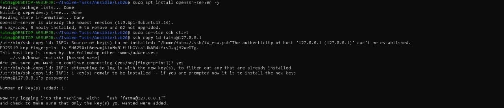

# 🚀 Lab 26: Initial Ansible Configuration & Ad-Hoc Execution

This lab focuses on the fundamental setup of an **Ansible Control Node** on WSL and establishing a secure, agentless connection with a **Managed Node** (Localhost) to perform automated system tasks.

---

## 🎯 Lab Objective

Establish the core Ansible infrastructure and verify connectivity through the following steps:

1. **Environment Setup:** Install and configure Ansible on the Control Node.
2. **Security:** Generate a new RSA SSH key pair for secure authentication.
3. **Key Distribution:** Transfer the public key to the Managed Node using `ssh-copy-id`.
4. **Inventory Management:** Create a host file (Inventory) to manage target nodes.
5. **Ad-Hoc Testing:** Execute a real-time command to verify disk space on the target node.

---

## 🏗️ Architecture Overview

The setup utilizes **WSL (Ubuntu)** as the Control Node. In this environment, the machine manages itself (Localhost) via SSH, simulating a remote server interaction.
---

## 🧪 Prerequisites

- **Control Node:** Ubuntu on WSL.
- **Managed Node:** Localhost (127.0.0.1) or a remote Linux VM.
- **SSH Service:** `openssh-server` installed and active on the managed node.

---

## 🛠️ Implementation Steps

### 1. Install Ansible
Updated the package repository and installed the Ansible automation platform.

```bash
sudo apt update
sudo apt install ansible -y
# Ensure SSH server is active for connectivity
sudo service ssh start
```
### 2. Establish SSH Connectivity

To enable automation without manual password prompts, I generated an RSA key pair and shared it with the managed node.

Generate Key: ```ssh-keygen -t rsa``` (Default settings applied).

Transfer Key: ```bash ssh-copy-id fatma@127.0.0.1```

### 3. Inventory Configuration
Defined the managed host in a file named `inventory` to allow Ansible to target specific groups or servers.

```bash
nano inventory
[local]
127.0.0.1 ansible_connection=local
```

### 4. Verification & Ad-Hoc Execution
I verified the communication between nodes and performed a system check using Ansible Ad-hoc commands.

Connectivity Check (Ping):

```bash
ansible local -i inventory -m ping
```

## ✅ Validation Checklist

- [ ] Ansible platform successfully installed.

- [ ] SSH RSA key pair generated.

- [ ] Public key successfully added to authorized_keys on the managed node.

- [ ] Inventory file correctly configured with target IP.

- [ ] Received "pong" response from the managed node.

- [ ] Successfully retrieved disk usage data via Ad-hoc comman.

---

## 📸 Screenshots

1. Ansible Ping Success


2. Disk Space Ad-Hoc Command



---

## 💡 Key Learnings
- Agentless Automation: Ansible doesn't require software on managed nodes, only SSH.

- Security: Using SSH keys is the standard for secure, automated infrastructure management.

- Ad-Hoc Commands: Great for quick tasks and troubleshooting without the need for full Playbooks.

---

## ✨ Author

Fatma Alaa Hassan