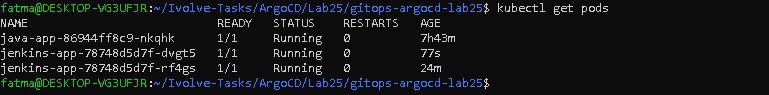
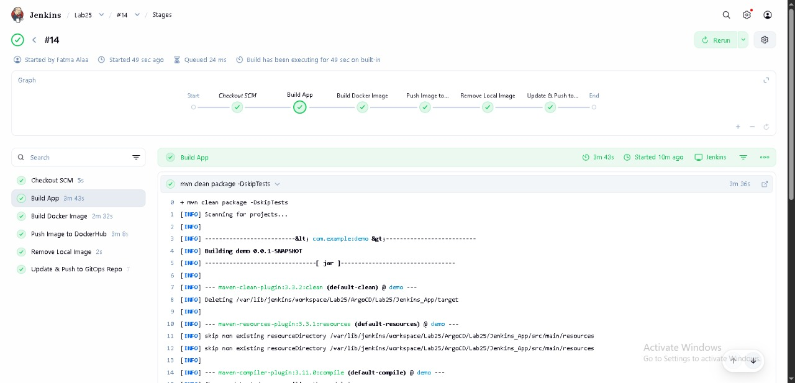
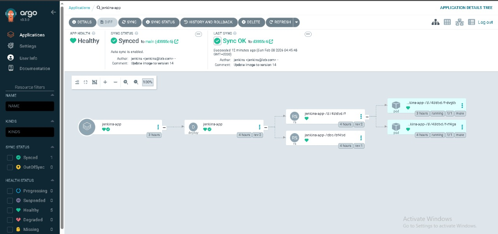

# 🚀 Lab 25: GitOps Workflow with Jenkins & ArgoCD

This lab demonstrates a complete **GitOps workflow**, focusing on the separation between **Continuous Integration (CI)** and **Continuous Delivery (CD)**. We automate the build process with Jenkins and use **ArgoCD** as the GitOps controller to sync our Kubernetes cluster with the desired state defined in Git.

---

## 🎯 Lab Objective

Automate the full delivery flow using a GitOps-based approach:

1. **Build App:** Compile the Java application using Maven.
2. **Build Docker Image:** Create a container image for the application.
3. **Push Image:** Upload the image to Docker Hub with a unique build tag.
4. **Remove Local Image:** Clean the Jenkins workspace to save space.
5. **Update Manifest:** Modify the `deployment.yaml` in the **GitOps Repo** with the new image tag.
6. **Git Push:** Push the changes back to GitHub to trigger ArgoCD.
7. **ArgoCD Sync:** Automate the deployment of the new image into the Kubernetes cluster.

---

## 🏗️ Architecture Overview

The pipeline follows the GitOps "Single Source of Truth" principle. Jenkins updates the manifest repository, and ArgoCD monitors that repository to apply changes to Kubernetes.


---

## 🧪 Prerequisites

- **Jenkins Server:** Installed with Docker, Maven, and Git.
- **Kubernetes Cluster:** (Minikube, K3s, or Managed Cloud Cluster).
- **ArgoCD:** Installed and running inside the cluster.
- **Repositories:**
    - **App Repo:** `https://github.com/FatmaAHassan/Ivolve-Tasks.git`
    - **GitOps Repo:** `https://github.com/FatmaAHassan/gitops-argocd-lab25.git`

---

## 🔑 Credentials Setup

Add the following credentials in **Manage Jenkins** -> **Credentials**:

| Credential ID | Type | Description |
| :--- | :--- | :--- |
| `dockerhub` | Username with Password | Your DockerHub login info. |
| `github-token` | Username with Password | GitHub Username + Personal Access Token (PAT) with `repo` permissions. |

---

## 📝 Jenkinsfile (The CI Pipeline)

```groovy
pipeline {
    agent any

    environment {
        DOCKER_IMAGE = "fatmaahassan/jenkins-app"
        TAG = "${env.BUILD_NUMBER}"
        GITOPS_REPO_URL = "[github.com/FatmaAHassan/gitops-argocd-lab25.git](https://github.com/FatmaAHassan/gitops-argocd-lab25.git)"
    }

    stages {
        stage('Build App') {
            steps {
                dir('ArgoCD/Lab25/Jenkins_App') {
                    sh "mvn clean package -DskipTests"
                }
            }
        }

        stage('Build Docker Image') {
            steps {
                dir('ArgoCD/Lab25/Jenkins_App') {
                    sh "docker build -t $DOCKER_IMAGE:$TAG ."
                }
            }
        }

        stage('Push Image to DockerHub') {
            steps {
                withCredentials([usernamePassword(credentialsId: 'dockerhub', usernameVariable: 'USER', passwordVariable: 'PASS')]) {
                    sh "echo $PASS | docker login -u $USER --password-stdin"
                    sh "docker push $DOCKER_IMAGE:$TAG"
                }
            }
        }

        stage('Remove Local Image') {
            steps {
                sh "docker rmi $DOCKER_IMAGE:$TAG || true"
            }
        }

        stage('Update & Push to GitOps Repo') {
            steps {
                withCredentials([usernamePassword(credentialsId: 'github-token', passwordVariable: 'GIT_PASS', usernameVariable: 'GIT_USER')]) {
                    sh """
                    rm -rf gitops-argocd-lab25
                    git clone https://${GIT_USER}:${GIT_PASS}@${GITOPS_REPO_URL}
                    cd gitops-argocd-lab25
                    sed -i 's|image:.*|image: $DOCKER_IMAGE:$TAG|' deployment.yaml
                    git config user.email "jenkins@lab.com"
                    git config user.name "jenkins"
                    git add deployment.yaml
                    git commit -m "Update image to version $TAG"
                    git push origin main
                    """
                }
            }
        }
    }
}
```

---

## ☸️ ArgoCD Deployment Steps
1- Install ArgoCD:

```bash

kubectl create namespace argocd
kubectl apply -n argocd -f [https://raw.githubusercontent.com/argoproj/argo-cd/stable/manifests/install.yaml](https://raw.githubusercontent.com/argoproj/argo-cd/stable/manifests/install.yaml)

```
2- Create Application:

Define the source as your GitOps Repo.

Define the destination as your K8s Cluster.

Set Sync Policy to ``` Automatic```


## ✅ Validation Checklist

- [ ] Jenkins pipeline finishes with SUCCESS.

- [ ] Docker image with tag BUILD_NUMBER exists on Docker Hub.

- [ ] deployment.yaml in GitOps repo is updated with the latest tag.

- [ ] ArgoCD detects the commit and updates the pods automatically.

- [ ] Application is accessible via Service ClusterIP/NodePort.

---

## 📸 Screenshots
Kubectl Pods .


Jenkins Pipeline stage .


ArgoCD Dashboard  .




---

## 💡 Key Learnings
- Git as Source of Truth: Any change in the cluster must come from a Git commit.

- Automation: Using sed inside Jenkins enables seamless manifest updates.

- Security: Using withCredentials prevents sensitive data (Tokens/Passwords) from appearing in console logs.

---

## ✨ Author

Fatma Alaa Hassan