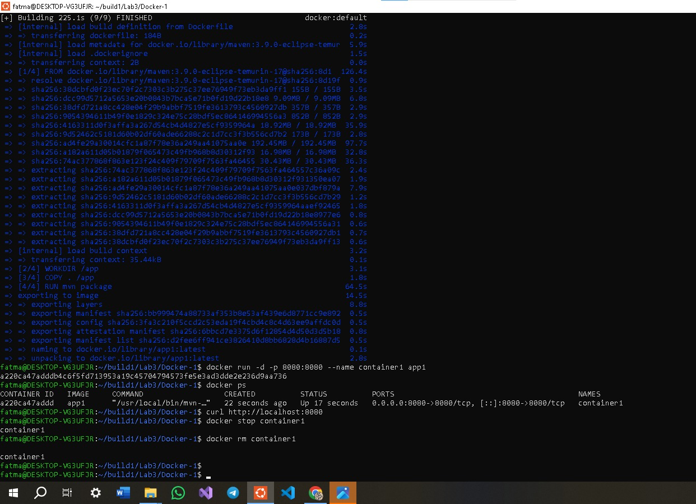

## LAB3 – Run Java Spring Boot App in a Container (Docker)

This lab demonstrates how to run a **Java Spring Boot** application inside a **Docker container** using Maven.

## Commands

# Clone the Application
git clone https://github.com/Ibrahim-Adel15/Docker-1.git && cd Docker-1

# =Create Dockerfile
echo "FROM maven:3.9.0-eclipse-temurin-17
WORKDIR /app
COPY . /app
RUN mvn package
EXPOSE 8080
CMD [\"java\", \"-jar\", \"target/demo-0.0.1-SNAPSHOT.jar\"]" > Dockerfile

# Build Docker Image
docker build -t app1 .

# Run Container from Image
docker run -d -p 8080:8080 --name container1 app1

# Test Application
curl http://localhost:8080

# Stop and Remove Container
docker stop container1 && docker rm container1

### Build Success

### Application Running

