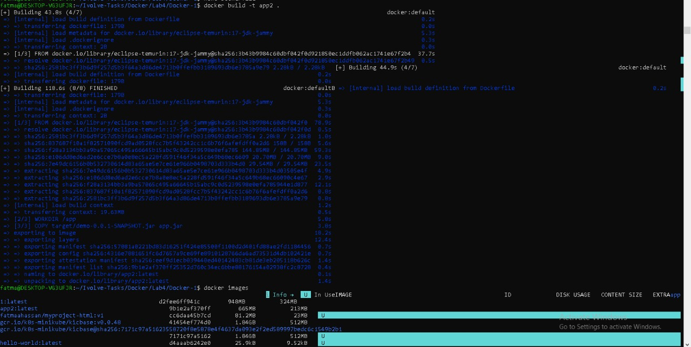
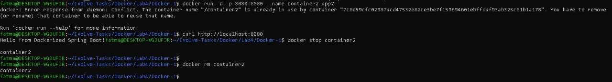
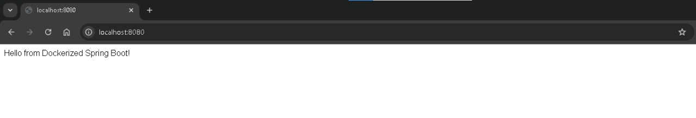

# Lab 4: Run Java Spring Boot App in a Container

This lab demonstrates how to containerize and run a **Java Spring Boot** application using **Docker**.

---

## Step 1: Clone the Application Source Code

```bash
git clone https://github.com/Ibrahim-Adel15/Docker-1.git
cd Docker-1
```

---

## Step 2: Build the Application JAR

```bash
mvn clean package
```
Verify JAR file exists:

```bash 
ls -lh target/demo-0.0.1-SNAPSHOT.jar
```
## Step 3: Create Dockerfile

Create a file named `Dockerfile`:

```bash
vim Dockerfile
```

Dockerfile content:

```dockerfile
FROM eclipse-temurin:17-jre-alpine

WORKDIR /app

COPY ./target/demo-0.0.1-SNAPSHOT.jar app.jar

EXPOSE 8080

CMD ["java", "-jar", "app.jar"]

```

---

## Step 4: Build Docker Image

```bash
docker build -t app2 .
```

Verify image creation:

```bash
docker images
```

---

## Step 5: Run Docker Container

```bash
docker run -d -p 8080:8080 --name container2 app2
```

---

## Step 6: Test the Application

Using browser:

```text
http://localhost:8080
```

Or using curl:

```bash
curl http://localhost:8080
```

---

>## Screenshot (Lab4 Execution Result)







---


## Author

Fatma Alaa Hassan 