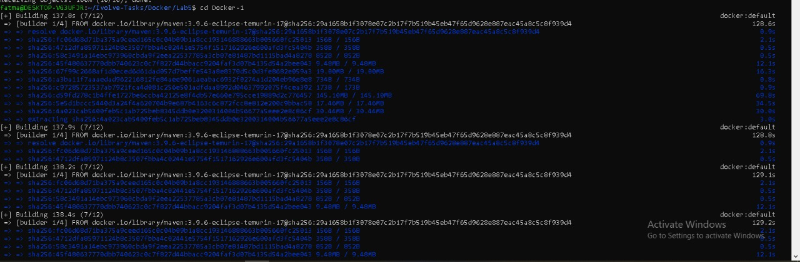
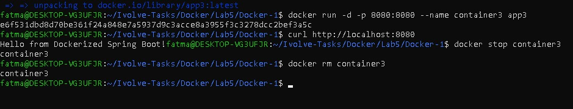
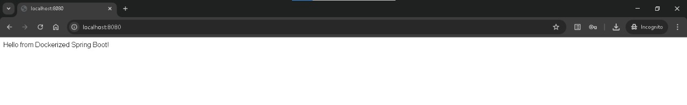

# Lab 5: Multi-Stage Build for a Spring Boot App

This lab demonstrates how to build and run a Java Spring Boot application using a Docker Multi-Stage Build to create a smaller and more efficient Docker image.

---

## Step 1: Clone the Application Source Code

```bash
git clone https://github.com/Ibrahim-Adel15/Docker-1.git
```

---

## Step 2: Create Dockerfile

Create a file named `Dockerfile`:

```bash
vim Dockerfile
```

Dockerfile content:

```dockerfile
FROM maven:3.9.6-eclipse-temurin-17 AS build

WORKDIR /app


COPY ./Docker-1 .

RUN mvn package

FROM eclipse-temurin:17-jre-alpine

WORKDIR /app

COPY --from=build /app/target/*.jar ./app_using_multi_stage.jar

EXPOSE 8080

CMD ["java", "-jar", "app_using_multi_stage.jar"]
```

---

## Step 3: Build Docker Image

```bash
docker build -t app1 .
```

Verify image creation:

```bash
docker images
```

---

## Step 4: Run Docker Container

```bash
docker run -d -p 8080:8080 --name container3 app3
```

---

## Step 5: Test the Application

Using browser:

```text
http://localhost:8080
```

Or using curl:

```bash
curl http://localhost:8080
```

---

>## Screenshot (Lab5 Execution Result)









---


## Author

Fatma Alaa Hassan