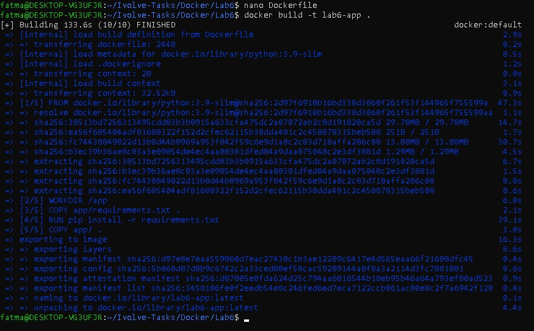
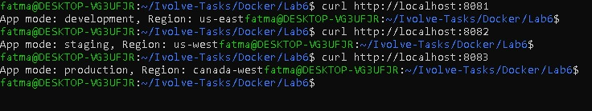
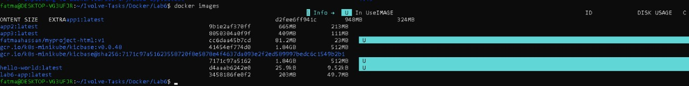
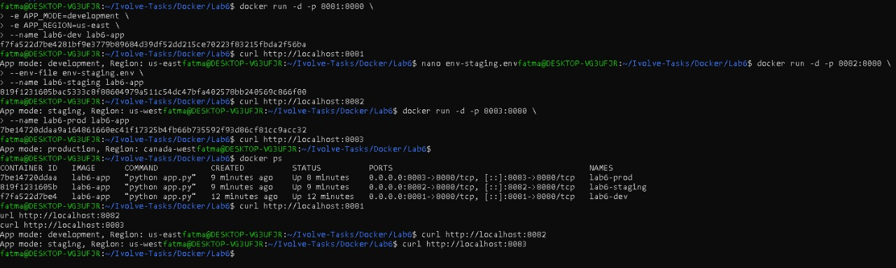

# Lab 6: Managing Docker Environment Variables Across Build and Runtime

This lab demonstrates how to manage environment variables in Docker at different stages:

 . At runtime using command-line

 . Using an environment file

 . Inside the Dockerfile

The application is a simple Python Flask app running inside a Docker container.
---

## Step 1: Clone the Application Source Code

```bash
git clone https://github.com/Ibrahim-Adel15/Docker-3.git app
```

---

## Step 2: Application Code

Create app/app.py

```bash
import os
from flask import Flask

app = Flask(__name__)

@app.route('/')
def show_env():
    mode = os.getenv("APP_MODE", "default")
    region = os.getenv("APP_REGION", "unknown")
    return f"App mode: {mode}, Region: {region}"

if __name__ == '__main__':
    app.run(host='0.0.0.0', port=8080)

```

app/requirements.txt

```bash
flask
```

---

## Step 3: Create Dockerfile

Create a file named Dockerfile:
```bash
vim Dockerfile
```
Dockerfile content:
```dockerfile

FROM python:3.9-slim

WORKDIR /app

COPY app/requirements.txt .
RUN pip install -r requirements.txt

COPY app/ .

ENV APP_MODE=production
ENV APP_REGION=canada-west

EXPOSE 8080

CMD ["python", "app.py"]
```
---

## Step 4: Build Docker Image

```bash
docker build -t lab6-app .
```

Verify image creation:
```bash
docker images
```

---

## Step 5: Run Containers with Environment Variables

1️⃣ Using Command-Line Variables (development)

```bash
docker run -d -p 8081:8080 \
-e APP_MODE=development \
-e APP_REGION=us-east \
--name lab6-dev lab6-app
```

Tesr using curl:

```bash
curl http://localhost:8081
```

2️⃣ Using Environment File (staging)

```bash
vim env-staging.env
```

```env
APP_MODE=staging
APP_REGION=us-west
```

Run container:
```bash
docker run -d -p 8082:8080 \
--env-file env-staging.env \
--name lab6-staging lab6-app
```

Tesr using curl:

```bash
curl http://localhost:8082
```

3️⃣ Using Dockerfile Environment Variables (production)

```bash
docker run -d -p 8083:8080 \
--name lab6-prod lab6-app
```
Tesr using curl:

```bash
curl http://localhost:8082
```

---

>## Step6 : Verify Running Containers

```bash
docker ps
```

## 📸 Screenshots (Lab 6 Execution Result) 

### Docker Image Build








---


## Author

Fatma Alaa Hassan