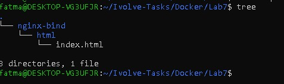
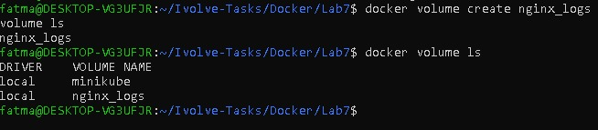
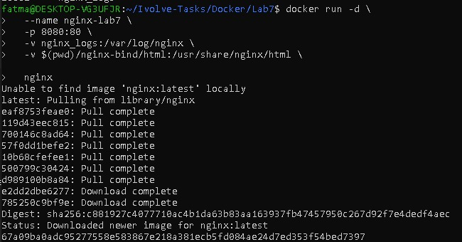
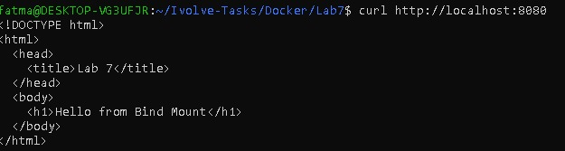
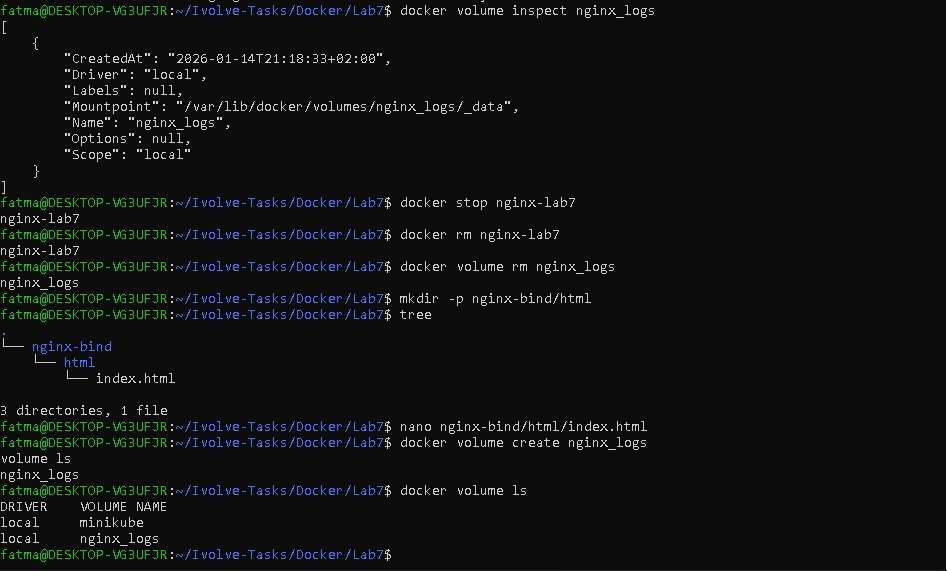

# Lab 7: Managing Docker Volumes and Bind Mounts

This lab demonstrates how to manage persistent data in Docker using:

Docker Named Volumes

Docker Bind Mounts

The application uses an Nginx container to serve static content while persisting logs using a Docker volume.
---

## Step 1: Create Lab Directory

```bash
cd ~/Ivolve-Tasks/Docker
mkdir Lab7
cd Lab7
```

---

## Step 2: Create Bind Mount Directory Structure

```bash
mkdir -p nginx-bind/html
```

Directory structure:
```text
Lab7/
└── nginx-bind/
    └── html/

```

---

## Step 3: Create HTML File

Create index.html:
```bash
nano nginx-bind/html/index.html
```

```html
<!DOCTYPE html>
<html>
  <head>
    <title>Lab 7</title>
  </head>
  <body>
    <h1>Hello from Bind Mount</h1>
  </body>
</html>

```
---

## Step 4: Create Docker Volume

Create a named volume to store Nginx logs:
```bash
docker volume create nginx_logs
```
```bash
docker volume ls
```

---

## Step 5: Run Nginx Container with Volume and Bind Mount


```bash
docker run -d \
 --name nginx-lab7 \
 -p 8080:80 \
 -v nginx_logs:/var/log/nginx \
 -v $(pwd)/nginx-bind/html:/usr/share/nginx/html \
 nginx
```

Verify container is running:

```bash
docker ps
```

---

## Step 6: Verify Application (Bind Mount)

Test using curl:
```bash
curl http://localhost:8080
```
Expected output:

```html
<h1>Hello from Bind Mount</h1>
```
---

## Step 7: Test Live Update (Bind Mount)

Edit the HTML file:
```bash
nano nginx-bind/html/index.html
```
Update content:

```html
<h1>Hello from Bind Mount - Updated</h1>
```
Test again:
```bash
curl http://localhost:8080
```
---

## Step 8: Verify Logs Inside the Container (Volume)

Enter the container:
```bash
docker exec -it nginx-lab7 bash
```
Check logs directory:

```bash
ls /var/log/nginx
```
Expected output:
```text
access.log
error.log
```

Exit container:
```bash
exit
```
---

## Step 9: Inspect Docker Volume

```bash
docker volume inspect nginx_logs
```
Verify mount location:
```text
/var/lib/docker/volumes/nginx_logs/_data
```
---

## Step 10: Cleanup Resources

```bash
docker stop nginx-lab7
docker rm nginx-lab7
docker volume rm nginx_logs
```
Verify cleanup:
```bash
docker ps
docker volume ls
```
---

## 📸 Screenshots (Lab 7 Execution Result) 








---


## Author

Fatma Alaa Hassan