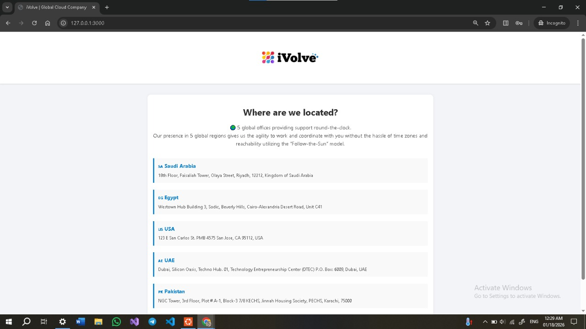
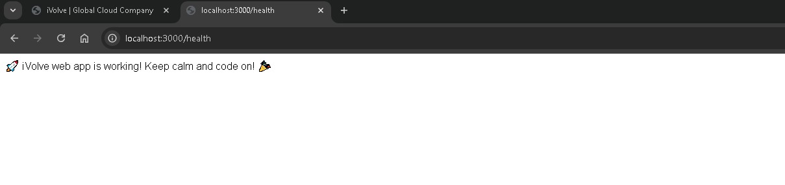
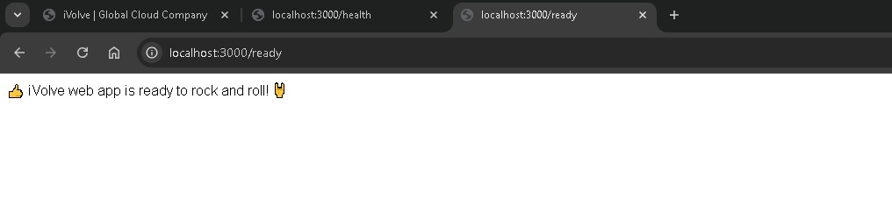
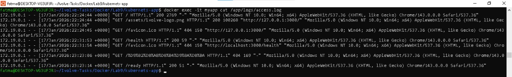
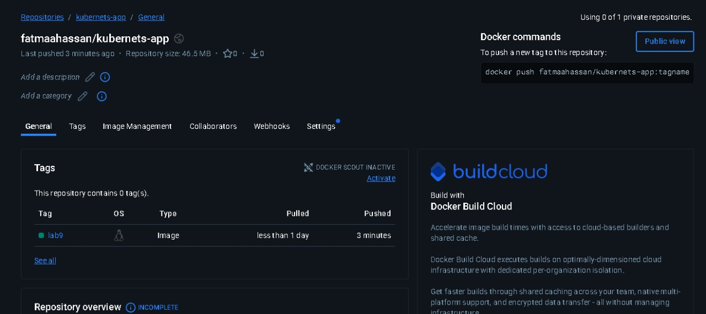

# Lab 9: Containerized Node.js and MySQL Stack Using Docker Compose
  This lab demonstrates how to containerize a Node.js application with a MySQL database using Docker Compose, configure environment variables, persist database data using volumes, and verify application health and logs.

---

## Prerequisites
- Docker
- Docker Compose
- Git
- DockerHub account

---

## Step 1: Clone the Application Repository
```bash
git clone https://github.com/Ibrahim-Adel15/kubernets-app.git

cd kubernets-app
```

---

## Step 2: Application Requirements
- Application runs on port 3000
- Requires MySQL database named `ivolve`
- Uses environment variables for database connection:
  - DB_HOST
  - DB_USER
  - DB_PASSWORD

---

## Step 3: Create docker-compose.yml
Create a file named `docker-compose.yml`:

```yaml
version: "3"
services:

  app_service:
    build: .
    container_name: myapp
    ports:
      - "3000:3000"
    environment:
      DB_HOST: mysql_db
      DB_USER: root
      DB_PASSWORD: root
    depends_on:
      - db_service


  db_service:
    image: mysql:8.0
    container_name: mysql_db
    environment:
      MYSQL_ROOT_PASSWORD: root
      MYSQL_DATABASE: ivolve
    volumes:
      - db_data:/var/lib/mysql

volumes:
  db_data:
```

---

## Step 4: Build and Run the Stack
```bash
docker compose up -d --build
```

---

## Step 5: Verify Application is Running
Check running containers:
```bash
docker ps
```

Access the application:
```text
http://localhost:3000
```
---

## Step 6: Verify Health Endpoints
```bash
curl http://localhost:3000/health

curl http://localhost:3000/ready
```

---

## Step 7: Verify Application Logs
```bash
docker exec -it myapp cat /app/logs/access.log
```

---

## Step 8: Push Image to DockerHub

Login to DockerHub:
```bash
docker login
```

Tag the image:
```bash
 docker tag myapp fatmaahassan/kubernets-app:lab9```
```
Push the image:
```bash
 docker push fatmaahassan/kubernets-app:lab9g>
```

---

## 📸 Screenshots (Lab 9 Execution Result)







---

## Author

Fatma Alaa Hassan