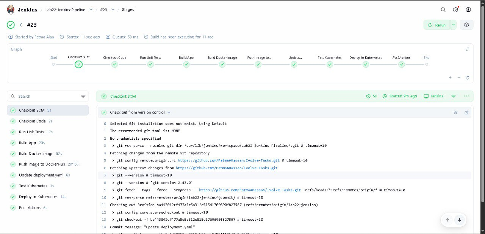

# 🚀 Lab 22: Jenkins Pipeline for Java App Deployment (My Way)

This lab demonstrates how to build a **Jenkins Pipeline** to deploy a Java application to a Kubernetes cluster in a clean and organized way.

---

## 🎯 Objective

Automate the deployment of a Java application on Kubernetes using Jenkins Pipeline. The pipeline performs the following tasks:

1. Run Unit Tests
2. Build the Java App using Maven
3. Build Docker Image
4. Push Docker Image to Docker Hub
5. Delete Local Docker Image
6. Update `deployment.yaml` with the new image
7. Deploy the application to Kubernetes Cluster

---

## 🛠️ Prerequisites

- Jenkins server with Docker installed
- Kubernetes cluster configured
- DockerHub account and credentials stored in Jenkins (`DockerHub` credential ID)
- Namespace `jenkins` exists in the cluster
- Jenkins agent has `kubectl` installed and configured

---

## 📂 Repository Structure

```
task22-repo/
│
├── Jenkinsfile          # Pipeline definition
├── Dockerfile           # Docker build instructions
├── deployment.yaml      # Kubernetes deployment file
└── src/...              # Java source code
```

---

## 🧩 Pipeline Stages

### 1️⃣ Unit Test
Runs Maven tests to validate the application.

```bash
mvn test
```

### 2️⃣ Build App
Builds the JAR package:

```bash
mvn clean package
```

### 3️⃣ Build Docker Image
Builds Docker image using the Dockerfile:

```bash
docker build -t fatmaahassan/java_app:$BUILD_NUMBER .
```

### 4️⃣ Push Docker Image to Docker Hub
Logs in with Jenkins credentials and pushes the image:

```bash
echo $DOCKER_PASS | docker login -u $USER --password-stdin
docker push fatmaahassan/java_app:$BUILD_NUMBER
```

### 5️⃣ Delete Local Docker Image
Removes the local image to save space:

```bash
docker image rm fatmaahassan/java_app:$BUILD_NUMBER || true
```

### 6️⃣ Update deployment.yaml
Updates the Kubernetes deployment file with the new image tag:

```bash
sed -i 's|image:.*|image: fatmaahassan/java_app:$BUILD_NUMBER|' deployment.yaml
```

### 7️⃣ Deploy to Kubernetes
Applies the updated deployment to the `jenkins` namespace:

```bash
kubectl --kubeconfig=/var/lib/jenkins/.kube/config apply -f deployment.yaml
```

---

## ⚡ Post Actions

Pipeline includes post actions to handle the status:

- `always`: Display "Pipeline Finished ✅"
- `success`: Display "Deployment Successful 🎉"
- `failure`: Display "Pipeline Failed ❌ Check logs"

---

## ✅ Verification

1. Check pods in `jenkins` namespace:

```bash
kubectl get pods -n jenkins
```

2. Verify deployment:

```bash
kubectl get deployment java-app -n jenkins
```

Include screenshots of the above commands showing pods and deployment status.

---
## 📸 Screenshots



---

## 📌 Notes

- Make sure Jenkins agent has Docker and `kubectl` installed.
- Ensure DockerHub credentials are properly configured in Jenkins.
- Namespace `jenkins` must exist before running the pipeline.
- `$BUILD_NUMBER` is used to automatically version Docker images.

---

## ✨ Author

Fatma Alaa Hassan