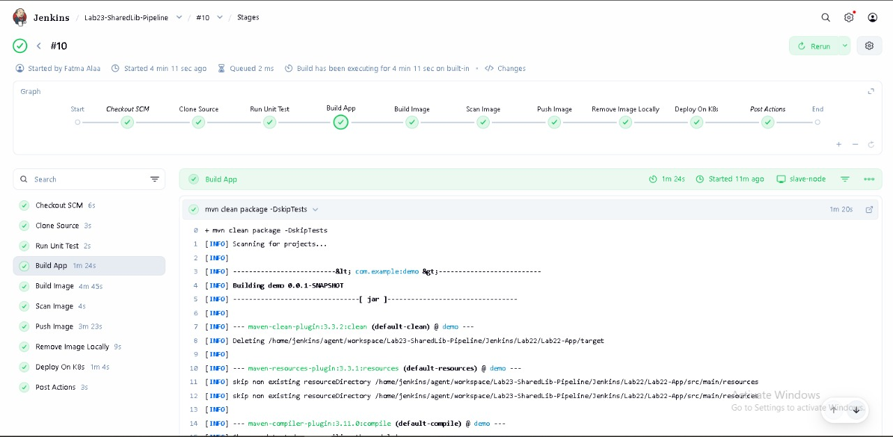

# 🚀 Lab 23: Jenkins CI/CD Pipeline with Agents & Shared Libraries

This lab demonstrates how to build a complete **CI/CD pipeline using Jenkins**, leveraging **Agents** and **Shared Libraries** to create a clean, reusable, and production-like pipeline.

---

## 🎯 Lab Objective

Automate the full delivery flow from source code to Kubernetes deployment:

1. Run Unit Tests
2. Build Application using Maven
3. Build Docker Image
4. Scan Docker Image
5. Push Docker Image to Docker Hub
6. Remove Local Docker Image
7. Deploy Application to Kubernetes

---

## 🧪 Prerequisites (Agent VM)

Make sure the following tools are installed and working on the Jenkins Agent:

- Java
  ```bash
  java -version
  ```
- Maven
  ```bash
  mvn --version
  ```
- Docker
  ```bash
  docker ps
  ```
- kubectl
  ```bash
  kubectl version
  ```
- Network connectivity between Jenkins Controller and Agent
- SSH access enabled

---

## 🔑 Jenkins Agent Setup

### 1️⃣ Generate SSH Key on Jenkins Controller

```bash
ssh-keygen -t rsa -b 2048 -f ~/.ssh/jenkins_agent_key
ssh-copy-id -i ~/.ssh/jenkins_agent_key.pub user@agent-ip
ssh -i ~/.ssh/jenkins_agent_key user@agent-ip
```

---

### 2️⃣ Create Agent Home Directory

```bash
sudo mkdir /home/jenkins_home
sudo chmod 777 /home/jenkins_home
```

---

### 3️⃣ Add SSH Credentials to Jenkins

From Jenkins Dashboard:

- Manage Jenkins → Credentials → Add Credentials
- Kind: **SSH Username with private key**
- Username: Agent VM user
- Private Key: Paste the generated private key

---

### 4️⃣ Add Jenkins Node (Agent)

- Manage Jenkins → Nodes → New Node
- Name: `linux-agent`
- Type: Permanent Agent
- Remote root directory: `/home/jenkins_home`
- Labels: `agent-1`
- Launch method: SSH or JNLP

---

## 📂 Jenkins Shared Library

To avoid code duplication and keep the Jenkinsfile clean, a **Shared Library** is used.

### 📁 Library Structure

```
vars/
├── runUnitTest.groovy
├── buildApp.groovy
├── buildImage.groovy
├── scanImage.groovy
├── pushImage.groovy
├── deleteImage.groovy
└── deployOnK8s.groovy
```

Each file contains a function that can be directly called inside the Jenkinsfile.

---

### 🔗 Add Shared Library to Jenkins

- Manage Jenkins → System
- Global Pipeline Libraries → Add
- Name: `shared-lib`
- Default version: `main`
- SCM: Git (Shared Library repository URL)

---

## 📝 Jenkinsfile

```groovy
@Library('my-shared-library') _

pipeline {
    agent { label 'slave-node' } 

    environment {
        IMAGE_NAME = 'fatmaahassan/java_app'
        IMAGE_TAG  = "${env.BUILD_NUMBER}"
        KUBECONFIG = '/home/fatma/.kube/config' 
    }

    stages {
        stage('Clone Source') {
            steps {
                git branch: 'lab22-jenkins', url: 'https://github.com/FatmaAHassan/Ivolve-Tasks.git'
            }
        }

        stage('Run Unit Test') {
            steps {
                script {
                    runUnitTest() 
                }
            }
        }

        stage('Build App') {
            steps {
                dir('Jenkins/Lab22/Lab22-App') {
                    sh "mvn clean package -DskipTests"
                }
            }
        }

        stage('Build Image') {
            steps {
                dir('Jenkins/Lab22/Lab22-App') {
                    script {
                        buildImage(IMAGE_NAME, IMAGE_TAG)
                    }
                }
            }
        }

        stage('Scan Image') {
            steps {
                echo "Scanning image for vulnerabilities..."
                sh "docker inspect ${IMAGE_NAME}:${IMAGE_TAG} || true"
            }
        }

        stage('Push Image') {
            steps {
                withCredentials([usernamePassword(credentialsId: 'dockerhub-creds', usernameVariable: 'DOCKER_CREDS_USR', passwordVariable: 'DOCKER_CREDS_PSW')]) {
                    sh "echo $DOCKER_CREDS_PSW | docker login -u $DOCKER_CREDS_USR --password-stdin"
                    sh "docker push ${IMAGE_NAME}:${IMAGE_TAG}"
                }
            }
        }

        stage('Remove Image Locally') {
            steps {
                script {
                    removeImage(IMAGE_NAME, IMAGE_TAG)
                }
            }
        }

        stage('Deploy On K8s') {
            steps {
                dir('Jenkins/Lab22/Lab22-App') {
                    script {
                        deployK8s(IMAGE_NAME, IMAGE_TAG)  
                    }
                }
            }
        }
    }

    post {
        always {
            echo "Pipeline finished."
        }
        success {
            echo "Application deployed successfully!"
        }
        failure {
            echo "Pipeline failed. Check logs for details."
        }
    }
}

```

---

## ✅ Validation Checklist

- Jenkins pipeline runs successfully on the Agent node
- Docker image is pushed to Docker Hub
- Kubernetes deployment is updated with the new image
- Application is running correctly inside the cluster

---

## 📸 Screenshots



Add Jenkins pipeline Photo .

---

## Notes

- Shared Libraries help keep the Jenkinsfile clean and reusable
- Jenkins Agents allow workload distribution instead of running everything on the controller
- This lab reflects a real-world CI/CD pipeline setup
---

## ✨ Author

Fatma Alaa Hassan