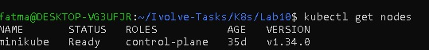
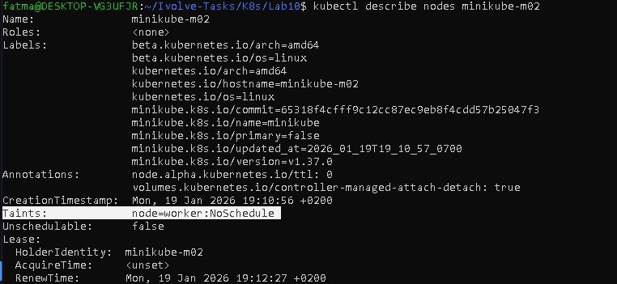
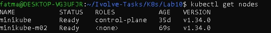

# Lab 10: Node Isolation Using Taints in Kubernetes

## Objective
The objective of this lab is to demonstrate node isolation in Kubernetes using taints.
A taint is applied to a worker node to prevent pods from being scheduled on it.

---

## Environment
- Kubernetes Cluster: Minikube
- Number of Nodes: 2
- Kubernetes Version: v1.34.0
- Container Runtime: containerd

---

## Steps

### Step 1: Verify Cluster Nodes
Check that the cluster is running with two nodes:

```bash
kubectl get nodes
```
###Step 2: Apply Taint to Worker Node
``bash
kubectl taint nodes minikube-m02 node=worker:NoSchedule
```
### Step 3: Verify the Taint
```bash
kubectl describe node minikube-m02
```
## 📸 Screenshots (Lab 9 Execution Result)




---

## Author

Fatma Alaa Hassan