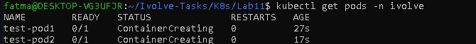
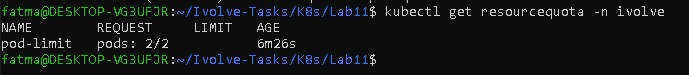
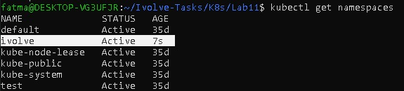
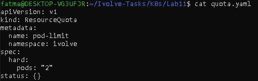
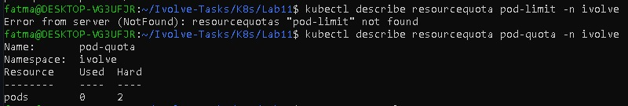

# Lab 11: Namespace Management and Resource Quota Enforcement

## Objective
The objective of this lab is to manage Kubernetes namespaces and enforce
resource limits using ResourceQuota.

---

## Environment
- Kubernetes Cluster: Minikube
- Number of Nodes: 2
- Kubernetes Version: v1.34.0
- Container Runtime: containerd

---

## Steps

### Step 1: Create Namespace
A new namespace named `ivolve` was created:

```bash
kubectl create namespace ivolve
```


### Step 2: Apply ResourceQuota
```bash
kubectl create quota pod-quota \
--hard=pods=2 \
-n ivolve \
--dry-run=client -o yaml > quota.yaml
```


### Step 3: Verify ResourceQuota
```bash
kubectl get resourcequota -n ivolve
kubectl describe resourcequota pod-quota -n ivolve
```


### Step 4: Test Quota Enforcement
- Two pods were created successfully:
```bash
kubectl run pod1 --image=nginx -n ivolve
kubectl run pod2 --image=nginx -n ivolve
```
- Attempting to create a third pod resulted in an error:
```bash
kubectl run pod3 --image=nginx -n ivolve
```


## 📸 Screenshots (Lab 11 Execution Result)






---

## Author

Fatma Alaa Hassan