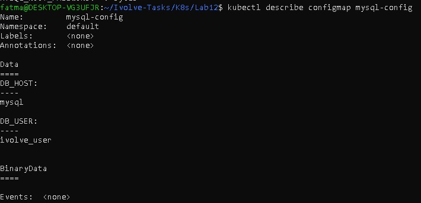
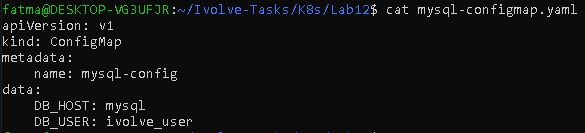
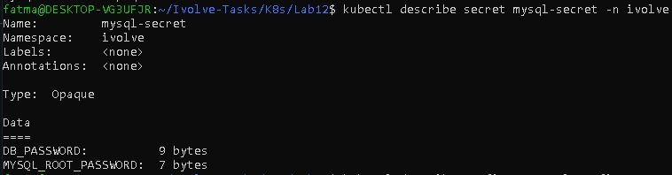
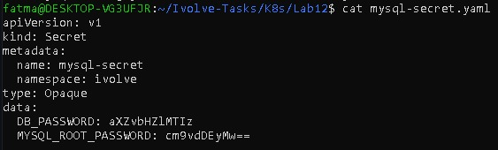

# Lab 12: Managing Configuration and Sensitive Data with ConfigMaps and Secrets

## Objective
The objective of this lab is to manage application configuration and sensitive
data in Kubernetes using ConfigMaps and Secrets.

---

## Environment
- Kubernetes Cluster: Minikube
- Kubernetes Version: v1.34.0
- Container Runtime: containerd

---

### Non-Sensitive Data (ConfigMap)
- DB_HOST: Hostname of the MySQL StatefulSet service
- DB_USER: Database user used by the application to connect to the ivolve database

### Sensitive Data (Secret)
- DB_PASSWORD: Password for the database user
- MYSQL_ROOT_PASSWORD: Root password for the MySQL database

---

## Steps

### Step 1: Create ConfigMap
A ConfigMap was created to store non-sensitive MySQL configuration values.
```bash
vim mysql-configmap.yaml
kubectl apply -f mysql-configmap.yaml
```
### Step 2: Encode Sensitive Data Using Base64
```bash
echo -n ivolve123 | base64
echo -n root123 | base64
```

### Step 3: Create Secret
- A Secret was created to store sensitive MySQL credentials securely.
```bash
vim mysql-secret.yaml
kubectl apply -f mysql-secret.yaml
```


### Step 4: Verify Resources
``` bash
kubectl get configmap
kubectl get secrets
```
```bash
kubectl describe configmap mysql-config
kubectl describe secret mysql-secret
```

## 📸 Screenshots (Lab 12 Execution Result)






---

## Author

Fatma Alaa Hassan