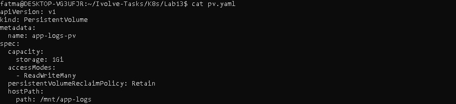
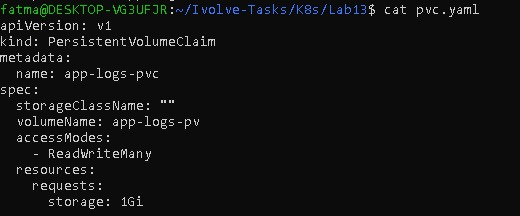
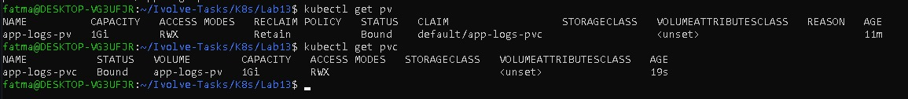

# Lab 13: Persistent Storage Setup for Application Logging

## Objective
The objective of this lab is to set up persistent storage for application logs
using Persistent Volumes (PV) and Persistent Volume Claims (PVC) in Kubernetes.

---

## Environment
- Kubernetes Cluster: Minikube
- Kubernetes Version: v1.34.0
- Container Runtime: containerd

---
### Check that the cluster is running
```bash
kubectl get nodes
```

### Step 1: Prepare Node Directory
Create a directory on the node to store application logs:

```bash
sudo mkdir -p /mnt/app-logs
sudo chmod 777 /mnt/app-logs
ls -ld /mnt/app-logs
```

### Step 2: Create Persistent Volume (PV)
```bash 
vim pv.yaml
```
```bash
kubectl apply -f pv.yaml
```
```bash
kubectl get pv
kubectl describe pv app-logs-pv
```

### Step 3: Create Persistent Volume Claim (PVC)
```bash
vim pvc.yaml
kubectl apply -f pvc.yaml 
kubectl get pvc             
kubectl describe pvc app-logs-pvc
```

### Final Verification
```bash
kubectl get pv
kubectl get pvc
```

## 📸 Screenshots (Lab 13 Execution Result)





---

## Author

Fatma Alaa Hassan