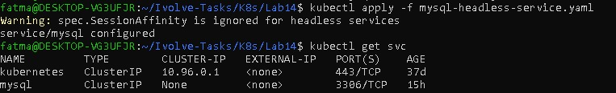
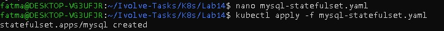
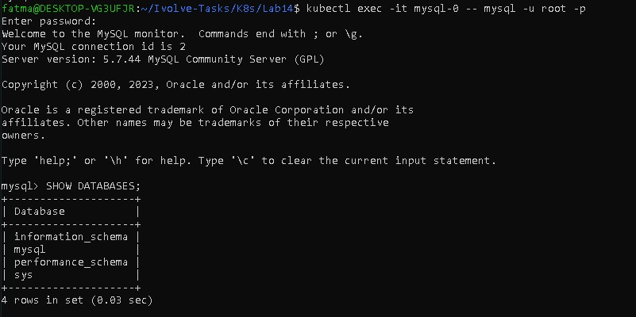

# Lab 14: StatefulSet with Headless Service (MySQL)

## Objective

Deploy a MySQL StatefulSet in Kubernetes with:

. Root password stored in a Secret

. Persistent storage via PVC

. Toleration for a tainted `node=worker:NoSchedule`

. Headless service for stable network identity
---


## Requirements

Kubernetes cluster (Minikube or other)

kubectl configured

Node with taint `node=worker:NoSchedule`

StorageClass (1Gi PVC)

---

### Steps

### Step 1 : Create MySQL Secret

```bash
kubectl create secret generic mysql-secret \
  --from-literal=MYSQL_ROOT_PASSWORD=MyStrongPass123
```
Verify:

```bash
kubectl get secret mysql-secret
```


### Step 2: Headless Service

File: `mysql-headless-service.yaml`

```bash 
apiVersion: v1
kind: Service
metadata:
  name: mysql
spec:
  clusterIP: None
  selector:
    app: mysql
  ports:
    - port: 3306
      name: mysql
```

Apply:

```bash
kubectl apply -f mysql-headless-service.yaml
kubectl get svc
```



### Step 3: StatefulSet
File: `mysql-statefulset.yaml`

```bash
apiVersion: apps/v1
kind: StatefulSet
metadata:
  name: mysql
spec:
  serviceName: mysql
  replicas: 1
  selector:
    matchLabels:
      app: mysql
  template:
    metadata:
      labels:
        app: mysql
    spec:
      tolerations:
        - key: "node"
          operator: "Equal"
          value: "worker"
          effect: "NoSchedule"
      containers:
        - name: mysql
          image: mysql:5.7
          ports:
            - containerPort: 3306
          env:
            - name: MYSQL_ROOT_PASSWORD
              valueFrom:
                secretKeyRef:
                  name: mysql-secret
                  key: MYSQL_ROOT_PASSWORD
          volumeMounts:
            - name: mysql-data
              mountPath: /var/lib/mysql
  volumeClaimTemplates:
    - metadata:
        name: mysql-data
      spec:
        accessModes:
          - ReadWriteOnce
        storageClassName: standard
        resources:
          requests:
            storage: 1Gi
```

Apply:

```bash
kubectl apply -f mysql-statefulset.yaml
```


### Step4 : Verify Resources

```bash
kubectl get pods
kubectl get statefulset
kubectl get pvc
```
Expected:
. Pod: mysql-0 → Running

. StatefulSet: 1/1

. PVC: Bound

. Service: ClusterIP=None


### Step 5 : Connect to MySQL

```bash
 kubectl exec -it mysql-0 -- mysql -u root -p
```

Password: MyStrongPass123

```bash
SHOW DATABASES;
```


 
---

## Author

Fatma Alaa Hassan