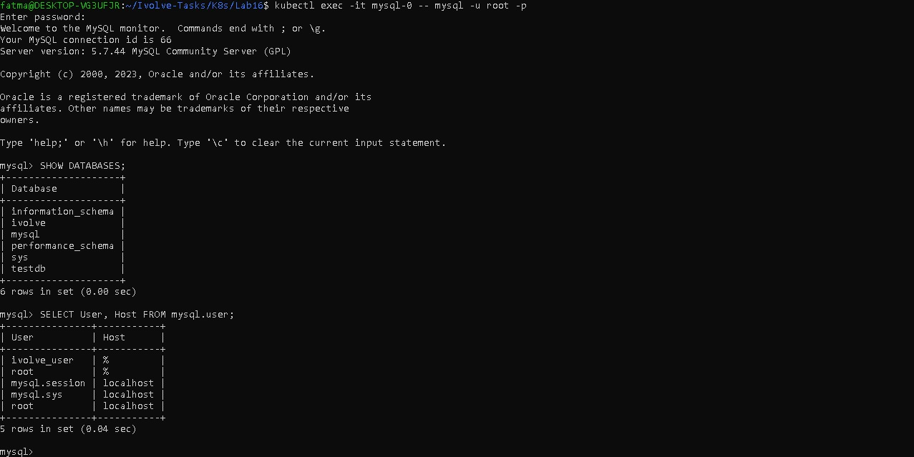
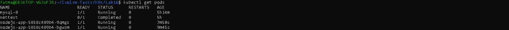

# Lab16-README.md - Kubernetes Init Container for Pre-Deployment Database Setup

## 🎯 Objective

In this lab, we will learn how to add an **Init Container** to a Node.js application on Kubernetes to perform a **Database setup** before the application runs:

* Create the `ivolve` database
* Create the user `ivolve_user` and grant all privileges on the database
* Use ConfigMap and Secret for DB connection

## 📚 Concepts Covered

* Init Container
* ConfigMap / Secret
* Persistent Volume Claim (PVC)
* Deployment update
* MySQL client container

## 📝Lab Overview

The goal here:

1- Run the existing Node.js Deployment (from Lab15)

2- Before the Pod starts:

* The Init Container connects to MySQL

* Creates the database and user

3- Node.js container starts only after Init Container finishes successfully
---

## 🏗 Components

### 1️⃣ Init Container
Image: `mysql:5.7` (official Docker Hub image)

Sets up the DB before Node.js container starts

Uses environment variables from Secret and ConfigMap


### 2️⃣ Node.js Application Pod

Starts only after the Init Container completes

Uses the PVC from Lab15 (`nodejs-pvc`)

Env vars from `nodejs-config` ConfigMap and `nodejs-secret` Secret

Image: `fatmaahassan/kubernets-app:lab9`

### 3️⃣ Persistent Volume Claim

Already created in Lab15

Mounted at `/usr/src/app/data` in the Pod

---
### ⚙️ Steps Followed in Lab16

### 1️⃣ Update Deployment to Add Init Container

File: `K8s/Lab15/deployment.yaml`

Key changes:

Added `initContainers` section with MySQL client image

Connected to MySQL pod via `DB_HOST`

Created `ivolve` database and `ivolve_user`

Used `mysql-secret` for root password (`MyStrongPass123`)

### 2️⃣ Apply the Deployment

```bash
kubectl apply -f K8s/Lab15/deployment.yaml
```

### 3️⃣ Check Pod Status

```bash
kubectl get pods
```
* Init Container will appear under the Init column
* Wait until it shows Completed, then Node.js container starts

### 4️⃣ Inspect Init Container Logs

```bash
kubectl logs nodejs-app-5858c489b4-9qmgs -c init-mysql
```
Expected output:

```bash
Waiting for MySQL...
Creating database and user...
```

### 5️⃣ Verify Database Manually

```bash
kubectl exec -it mysql-0 -- mysql -u root -p
```
Password: `MyStrongPass123`

```bash
SHOW DATABASES;
SHOW GRANTS FOR 'ivolve_user'@'%';
```
Ensure `ivolve` exists
Ensure `ivolve_user` exists with full privileges



### 6️⃣ Verify Node.js Application
```bash
kubectl get pods
kubectl get deployment
```


---

### ✅ Lab16 Complete

* Init Container successfully prepared the database

* Node.js app runs after Init Container finishes

* All steps verified manually
---

## Author

Fatma Alaa Hassan