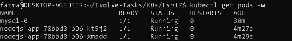

# Lab 17: Pod Resource Management with CPU and Memory Requests & Limits

## Objective

The goal of this lab is to practice **Pod Resource Management** in Kubernetes by configuring **CPU and Memory requests and limits** for a Deployment and verifying them at runtime.

---

## Lab Requirements

Update an existing Deployment to:

### Resource Requests

* **CPU:** 1 vCPU
* **Memory:** 1Gi

### Resource Limits

* **CPU:** 2 vCPUs
* **Memory:** 2Gi

### Verification

* Use `kubectl describe pod` to verify requests and limits
* Use `kubectl top pod` to monitor real-time resource usage

---

##  Files Used

* `nodejs-deployment.yaml`

---

## 📄 Deployment YAML

Modify deploment Yaml in lab15 :

```yaml
apiVersion: apps/v1
kind: Deployment
metadata:
  name: nodejs-app
spec:
  replicas: 2
  selector:
    matchLabels:
      app: nodejs
  template:
    metadata:
      labels:
        app: nodejs
    spec:
      tolerations:
        - key: "node"
          operator: "Equal"
          value: "worker"
          effect: "NoSchedule"

      initContainers:
      - name: init-mysql
        image: mysql:5.7
        env:
        - name: MYSQL_ROOT_PASSWORD
          valueFrom:
            secretKeyRef:
              name: mysql-secret
              key: mysql-root-password
        - name: DB_PASSWORD
          valueFrom:
            secretKeyRef:
              name: db-secret
              key: DB_PASSWORD
        - name: DB_HOST
          valueFrom:
            configMapKeyRef:
              name: db-config
              key: DB_HOST
        - name: DB_NAME
          valueFrom:
            configMapKeyRef:
              name: db-config
              key: DB_NAME
        - name: DB_USER
          valueFrom:
            configMapKeyRef:
              name: db-config
              key: DB_USER
        command:
        - sh
        - -c
        - |
          echo "Waiting for MySQL..."
          until mysql -h $DB_HOST -u root -p$MYSQL_ROOT_PASSWORD -e "SELECT 1"; do
            sleep 2
          done
          echo "Creating database and user..."
          mysql -h $DB_HOST -u root -p$MYSQL_ROOT_PASSWORD <<EOF
          CREATE DATABASE IF NOT EXISTS $DB_NAME;
          CREATE USER IF NOT EXISTS '$DB_USER'@'%' IDENTIFIED BY '$DB_PASSWORD';
          GRANT ALL PRIVILEGES ON $DB_NAME.* TO '$DB_USER'@'%';
          FLUSH PRIVILEGES;
          EOF

      containers:
      - name: nodejs
        image: fatmaahassan/kubernets-app:lab9
        ports:
        - containerPort: 3000
        envFrom:
        - configMapRef:
            name: nodejs-config
        - secretRef:
            name: nodejs-secret
        volumeMounts:
        - name: data
          mountPath: /usr/src/app/data
        resources:           
          requests:
            memory: "1Gi"
            cpu: "1"
          limits:
            memory: "2Gi"
            cpu: "2"

      volumes:
      - name: data
        persistentVolumeClaim:
          claimName: nodejs-pvc
```

---

## ▶️ Steps to Run

### 1️⃣ Apply the Deployment

```bash
kubectl apply -f nodejs-deployment.yaml
```

---

### 2️⃣ Verify Pod Status

```bash
kubectl get pods
```

Expected output:

```text
nodejs-app-xxxxx   1/1   Running
```

---

### 3️⃣ Verify Resource Requests & Limits

```bash
kubectl describe pod <POD_NAME>
```

Look for:

```text
requests:
    memory: "1Gi"
        cpu: "1"
    limits:
        memory: "2Gi"
        cpu: "2"
```


---

### 4️⃣ Monitor Resource Usage

> Metrics Server must be enabled

```bash
kubectl top pod
```

Sample output:

```text
NAME           CPU(cores)   MEMORY(bytes)
nodejs-app     10m          30Mi
```

---

## Key Concepts

* **Requests** define the minimum resources required by a Pod
* **Limits** define the maximum resources a Pod can consume
* If requests exceed node capacity, the Pod remains in `Pending` state
* CPU limits cause throttling, memory limits may cause OOMKill

---

## Author

Fatma Alaa Hassan