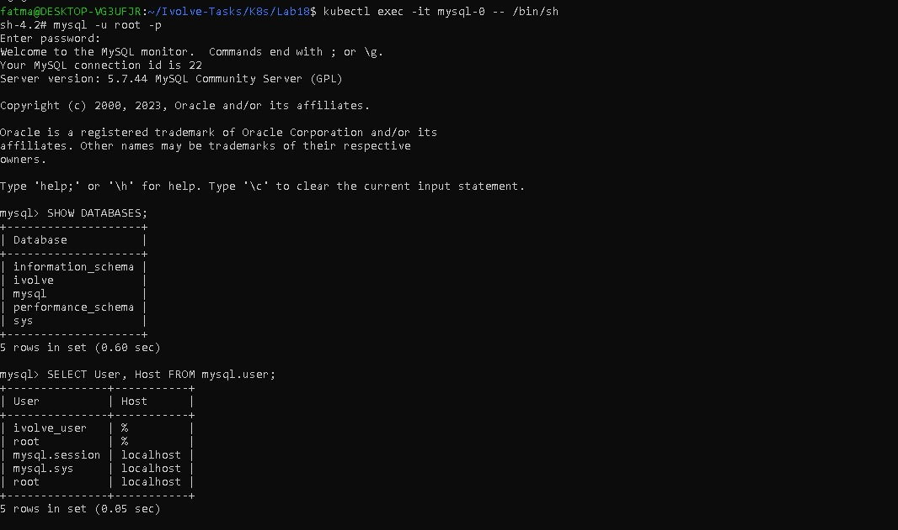
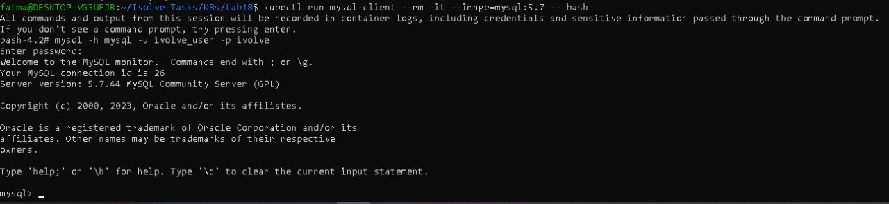

# Lab 18: Control Pod-to-Pod Traffic via Network Policy

## Objective

The goal of this lab is to **restrict Pod-to-Pod communication** in Kubernetes using a **NetworkPolicy**, allowing only specific Pods to access the MySQL database.

---

## Lab Requirements

Create a `NetworkPolicy` with the following specifications:

### 📌 NetworkPolicy Details

* **Name:** allow-app-to-mysql
* **Pod Selector:** Targets pods with label `app=mysql`
* **Policy Types:** Only `Ingress`
* **Ingress Rule:**
  * Allows traffic only from application pods (`app=nodejs`)
  * Restrict access to port `3306` (MySQL default port)

---

## 🗂️ Files Used

* `allow-app-to-mysql.yaml`
* Existing Node.js and MySQL Deployments from Lab 16 & 17

---

## 📄 NetworkPolicy YAML

```yaml
apiVersion: networking.k8s.io/v1
kind: NetworkPolicy
metadata:
  name: allow-app-to-mysql
spec:
  podSelector:
    matchLabels:
      app: mysql
  policyTypes:
  - Ingress
  ingress:
  - from:
    - podSelector:
        matchLabels:
          app: nodejs
    ports:
    - protocol: TCP
      port: 3306
```

---

## ▶️ Steps to Run

### 1️⃣ Apply the NetworkPolicy

```bash
kubectl apply -f allow-app-to-mysql.yaml
```


---

### 2️⃣ Verify Pods

```bash
kubectl get pods -o wide
```
Expected output:
```
NAME                          READY   STATUS    IP           NODE
mysql-0                       1/1     Running   10.244.0.xx  minikube
nodejs-app-xxxx               1/1     Running   10.244.0.xx  minikube
test-pod                      1/1     Running   10.244.0.xx  minikube
```


---

### 3️⃣ Test Pod-to-Pod Communication

1. Launch a temporary Pod to test access:
```bash
kubectl run mysql-client --rm -it --image=mysql:5.7 -- bash
```

2. Inside the Pod, test connection to MySQL:
```bash
mysql -h mysql -u ivolve_user -p ivolve
```
- Password: `ivolve123`
- Connection successful if allowed




---

## Key Concepts

* **NetworkPolicy** restricts traffic to Pods based on labels and ports
* **Ingress rules** control incoming traffic
* Only Pods matching the `from` selector can access the target Pod
* Helps isolate services and improve cluster security

---

## Author

Fatma Alaa Hassan
