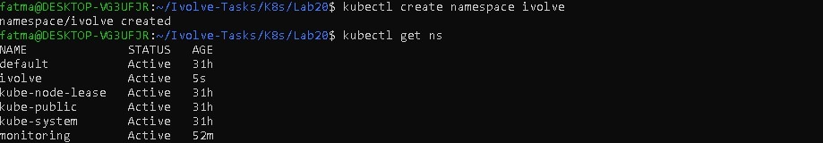
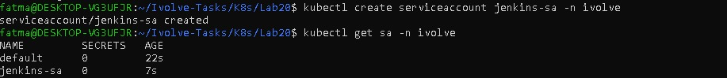
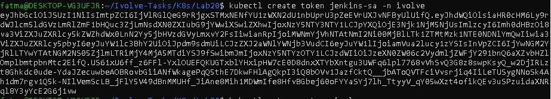
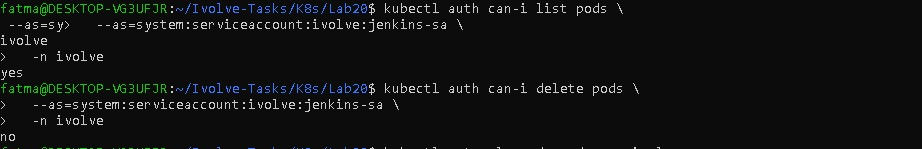

# Lab 20: Securing Kubernetes with RBAC and Service Accounts

## Objective
This lab demonstrates how to secure Kubernetes access using **RBAC** and **Service Accounts** by granting limited, read-only permissions.

---

## Lab Requirements
- Create a ServiceAccount for Jenkins.
- Create a Role with read-only access to Pods.
- Bind the Role to the ServiceAccount.
- Validate permissions using `kubectl auth can-i`.

---

## Files Used in This Lab
- `jenkins-sa.yaml`
- `pod-reader-role.yaml`
- `jenkins-rolebinding.yaml`

---

## Steps

### 1️⃣ Create Namespace

```bash
kubectl create namespace ivolve
kubectl get ns
```


---

### 2️⃣ Create Service Account

`jenkins-sa.yaml`

```yaml
apiVersion: v1
kind: ServiceAccount
metadata:
  name: jenkins-sa
  namespace: ivolve
```

Apply:
```bash
kubectl apply -f jenkins-sa.yaml
kubectl get sa -n ivolve
```



---

### 3️⃣ Generate Service Account Token

Generate a token for the Service Account:

```bash
kubectl create token jenkins-sa -n ivolve
```


--- 

### 4️⃣ Create Role (Read-Only Pods)

`pod-reader-role.yaml`

```yaml
apiVersion: rbac.authorization.k8s.io/v1
kind: Role
metadata:
  name: pod-reader
  namespace: ivolve
rules:
- apiGroups: [""]
  resources: ["pods"]
  verbs: ["get", "list"]
```

Apply:
```bash
kubectl apply -f pod-reader-role.yaml
kubectl get role -n ivolve
```


---

### 5️⃣ Create RoleBinding

`jenkins-rolebinding.yaml`

```yaml
apiVersion: rbac.authorization.k8s.io/v1
kind: RoleBinding
metadata:
  name: pod-reader-binding
  namespace: ivolve
subjects:
- kind: ServiceAccount
  name: jenkins-sa
  namespace: ivolve
roleRef:
  kind: Role
  name: pod-reader
  apiGroup: rbac.authorization.k8s.io
```

Apply:
```bash
kubectl apply -f jenkins-rolebinding.yaml
kubectl get rolebinding -n ivolve
```


---

### 6️⃣ Validate Permissions

✔ Can list pods:
```bash
kubectl auth can-i list pods \
  --as=system:serviceaccount:ivolve:jenkins-sa \
  -n ivolve
```

Expected:
```text
yes
```

❌ Cannot create pods:
```bash
kubectl auth can-i create pods \
  --as=system:serviceaccount:ivolve:jenkins-sa \
  -n ivolve
```

Expected:
```text
no
```


---

## Key Notes
- Roles are **namespace-scoped**
- RoleBinding is required to activate permissions
- ServiceAccount without binding has **zero access**

---

## Validation Checklist
- [x] Namespace created
- [x] ServiceAccount created
- [x] Generate & retrieve ServiceAccount token
- [x] Role created with read-only access
- [x] RoleBinding applied
- [x] Permissions validated successfully

---

## Author
Fatma Alaa Hassan