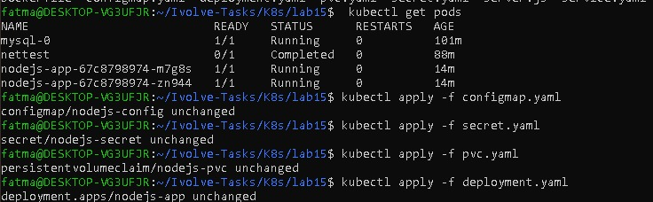
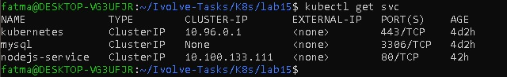
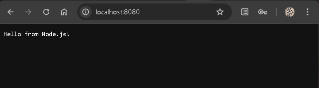

# Lab 15: Node.js Application Deployment with Kubernetes

## Objective

Deploy a Node.js application on Kubernetes using:

. Deployment with 2 replicas

. PersistentVolumeClaim (PVC)

. ConfigMap and Secret

. ClusterIP Service

. Node.js server listening on 0.0.0.0 for Port-forward

---

### Steps

### Step 1 : 1️⃣ Kubernetes Resources
ConfigMap 

```bash
apiVersion: v1
kind: ConfigMap
metadata:
  name: nodejs-config
data:
  DB_HOST: mysql-service
  DB_USER: nodeuser

```
Secret

```bash
apiVersion: v1
kind: Secret
metadata:
  name: nodejs-secret
type: Opaque
data:
  DB_PASSWORD: bXlwYXNzd29yZA==   # base64-encoded password

```
PersistentVolumeClaim

```bash
apiVersion: v1
kind: PersistentVolumeClaim
metadata:
  name: nodejs-pvc
spec:
  accessModes:
    - ReadWriteOnce
  resources:
    requests:
      storage: 1Gi
```

Deployment

```bash
apiVersion: apps/v1
kind: Deployment
metadata:
  name: nodejs-app
spec:
  replicas: 2
  selector:
    matchLabels:
      app: nodejs
  template:
    metadata:
      labels:
        app: nodejs
    spec:
      tolerations:
        - key: node
          operator: Equal
          value: worker
          effect: NoSchedule
      containers:
        - name: nodejs
          image: fatmaahassan/kubernets-app:lab9
          command: ["node", "-e", "require('http').createServer((req,res)=>res.end('Hello from Node.js!')).listen(3000, '0.0.0.0')"]
          ports:
            - containerPort: 3000
          envFrom:
            - configMapRef:
                name: nodejs-config
            - secretRef:
                name: nodejs-secret
          volumeMounts:
            - name: nodejs-data
              mountPath: /usr/src/app/data
      volumes:
        - name: nodejs-data
          persistentVolumeClaim:
            claimName: nodejs-pvc

```

ClusterIP Service

```bash 
apiVersion: v1
kind: Service
metadata:
  name: nodejs-service
spec:
  type: ClusterIP
  selector:
    app: nodejs
  ports:
    - port: 80
      targetPort: 3000
```

### Step 2: 2️⃣ Deploy to Kubernetes

```bash 
kubectl apply -f configmap.yaml
kubectl apply -f secret.yaml
kubectl apply -f pvc.yaml
kubectl apply -f deployment.yaml
kubectl apply -f service.yaml
```




### Step 3: 3️⃣ Verify Deployment

```bash
# Check pods status
kubectl get pods -w

# If pods are stuck or image updated, delete old pods
kubectl delete pod -l app=nodejs

# Reapply deployment if updated
kubectl apply -f deployment.yaml

# Describe pods if needed
kubectl describe pod <pod-name>
```


### Step4 : 4️⃣ Access the Node.js App

Option 1: Port-forward
```bash
kubectl port-forward svc/nodejs-service 8080:80
curl http://localhost:8080
# Output: Hello from Node.js!
```
Option 2: Minikube service
```bash
minikube service nodejs-service
# Opens app in browser automatically
```



---

## Author

Fatma Alaa Hassan